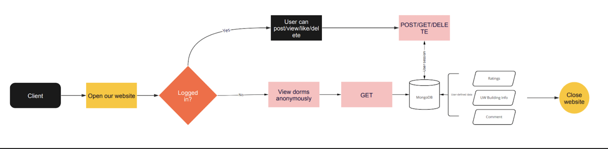

# info441_RateMyUW

Created by: Justin Chen, Lee Shi, Jerry Wang and Doris Yang

Project link: [RateMyUW](https://project.jcyyds.me)

## Project Description

Our target audience is UW students. Everyone in the UW community can benefit from additional resources about UW life. Additional audiences include staff and faculty members and they are also encouraged to use this application to share their opinions about everything on campus.

Our audience uses our application to view and rate anything related to life at UW. At this moment, we only have applications like [Rate My Professor](https://www.ratemyprofessors.com) and class rating system. However, college is not only about learning, we also need places to stay as well as attend different social activities. Therefore, a comprehensive platform that can indicate good and bad about places around campus would be desired by us to rate more places like dorms/buildings/restaurants/apartments.

As developers, we are a part of the UW community, and we wish to improve the college experience for ourselves and our peers. Looking for a dorm or other buildings' information can be stressful. The official introduction on the school's website does not tell students' personal experience. In addition, we envision many interactive features for the application that can utilize what we learned in the class and improve our programming skills.

## Technical Description

### Architectural Diagram

[Miro Board](https://miro.com/welcomeonboard/ZEs0b2F5QjhKbFJZSjNqcFJxZzBkaGNxVFJDTDMzOWNKRDlOM1JMNERJVnZqOU5yV1lNZXlkclUwTzhsRVF1SnwzMDc0NDU3MzUwODMwNjQ3NjI3?invite_link_id=208893898690)

### User Stories

| Priority      | User | Description      | Technical Implementation      |
| ----------- | ----------- | ----------- | ----------- |
| P0      | As a user       | I want to know what the residents think about each dorm so that I can have an idea of what dorm is the best option for me       | Implementing a search bar for users to search for their interests ||
| P0   | As a resident        |I want to share my opinions about dorms I have lived in to help people choose dorms          | Creating a feature that allows users to view ratings from the other users for buildings ||
|P0 | As a UW resident | I want to share my opinions about dorms I have lived in to help people choose dorms| Creating a feature that allows users to rate buildings ||
|P0 | As a user | I want to share my opinions about dorms I have lived in to help other people choose dorms | Creating a feature that allows users to rate buildings ||
|P0 | As a user | I want to like/unlike with others' comments | Creating a feature that allows users to like or unlike with a comment ||
|P0 | As a user | I want to delete my ratings | Creating Delete buttons||
|P1 | As a user | I would like to see similar dorm recommendations under the dorm I am viewing | Giving the users other dorms to view based on the locaiton of the dorm the user is viewing ||
|P2| As a user | I want to be able to report a rating if it is not appropriate | Creating a feature that allows uers to report ||
|P2 | As a user | I want to be able to add rating to my collection/favorite | Creating a feature that allows users to add to their collection/favorite folder||

As for now, we have completed all P0 user stories. P1 and P2 user stories will be implemented in future iterations. 

### Endpoints

/

GET: get the home page

/signin

GET: Sign in

/signout

GET: Sign out

/dorms

GET: Get all dorm information

/comments

GET: Get comments of the building

POST: Add new comments and rating

DELETE: Delete comments

/likeComment

POST: Add usernamt to likes of the comment

/unlikeComment

POST: Removes the username from the likes of the comment

/filterDorms

GET: Get selected dorm information

/dormInfo

GET: Get the dorm details

/getIdentity

GET: Get the user log in information
